# SMS Gateway

A self-hosted SMS gateway that provides a WebUI and REST API for sending and receiving SMS messages via a USB GSM modem. Built with Go and React, packaged as a single binary.

## Features

- Send and receive SMS messages through a USB GSM modem
- REST API with JWT and API key authentication
- React web interface with dashboard, inbox, outbox, and message management
- API key management for programmatic access
- User management with admin roles
- Health check endpoint for monitoring
- SQLite (default) or PostgreSQL database
- Interactive Swagger API documentation at `/swagger/`
- Single binary deployment (frontend embedded via `go:embed`)
- Cross-platform: Linux x86_64, macOS ARM64, Raspberry Pi

## Hardware Requirements

To run SMS Gateway, you need a USB GSM modem and an active SIM card with SMS capabilities.

### USB GSM Modem

We use and recommend the [SIM7600G-H 4G LTE USB Dongle](https://www.amazon.com/dp/B0BHQFTFPH?tag=mattboston-20). It supports global 4G LTE bands, works out of the box on Linux (including Raspberry Pi), and exposes a standard serial interface for AT commands. For detailed documentation, pinout diagrams, and troubleshooting, see the [Waveshare SIM7600G-H wiki](https://www.waveshare.com/wiki/SIM7600G-H_4G_DONGLE).


### SIM Card

Any SIM card with an active SMS plan will work. We use [Tello](https://tello.com/account/register?_referral=P30KX3Z2), which offers affordable pay-as-you-go plans on the T-Mobile network. I think I'm paying $8/month for unlimited SMS.

> **Note:** The links above are referral links. Using them helps support the development of this project and is greatly appreciated!
>
> If you'd like to support the project further, check out my [Amazon Wish List](https://www.amazon.com/hz/wishlist/ls/T3L6QCKZJ4Q4?ref_=wl_share).

## Screenshots

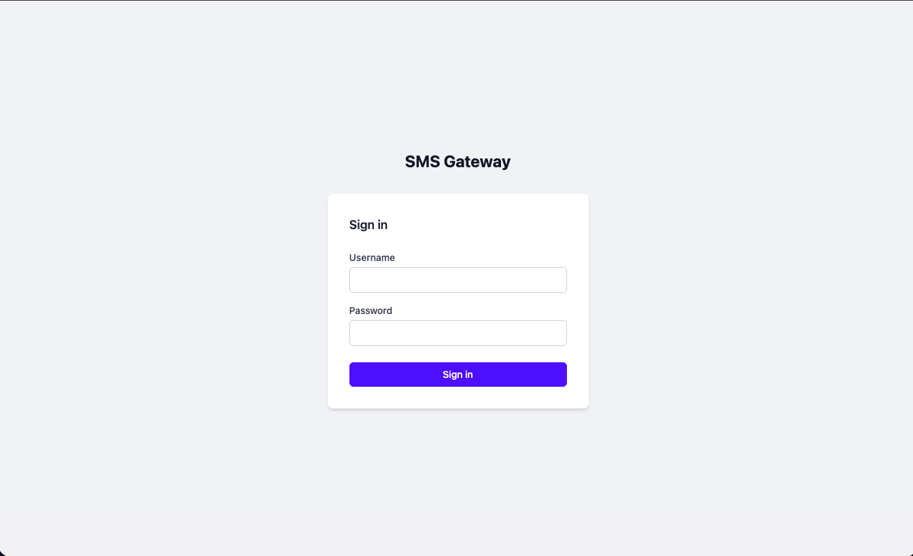
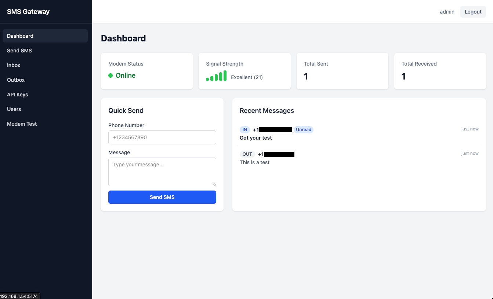
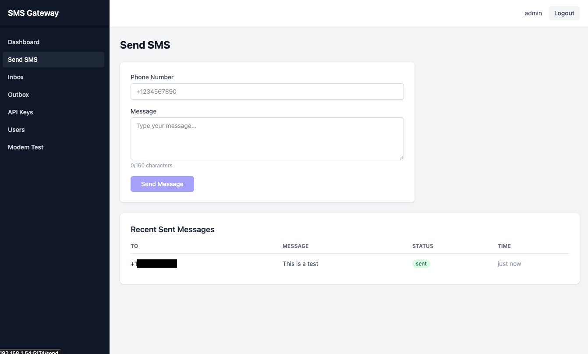
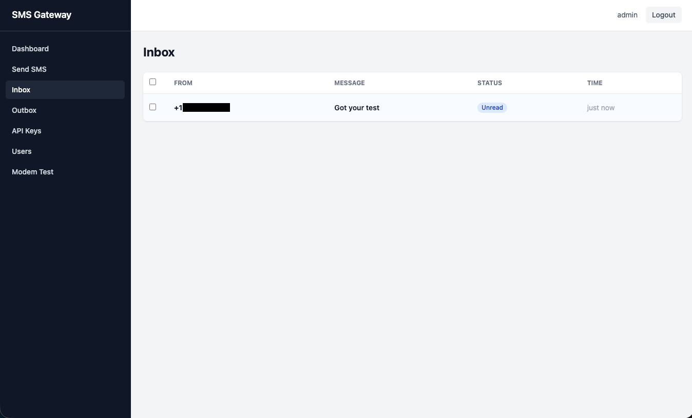
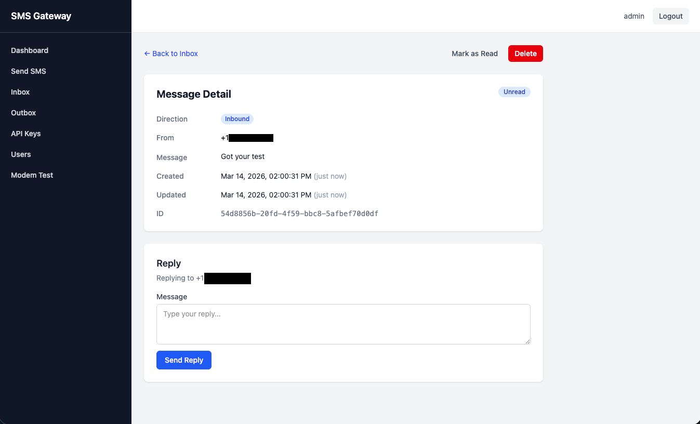
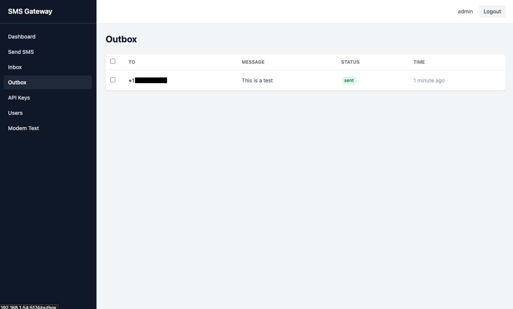
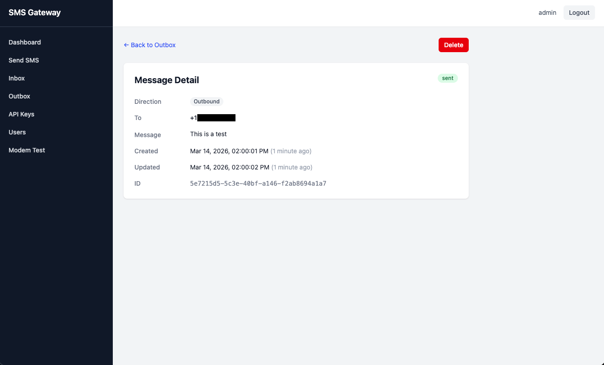
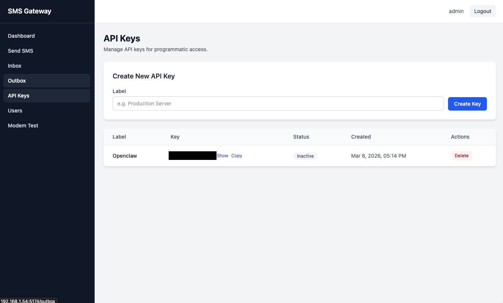
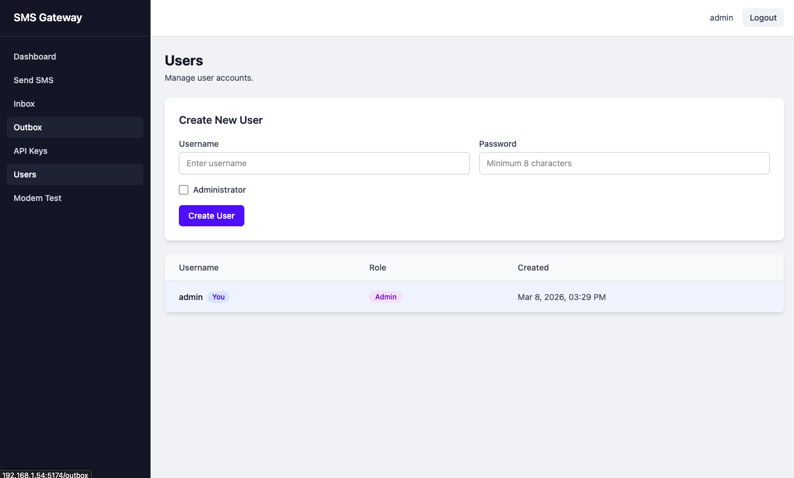
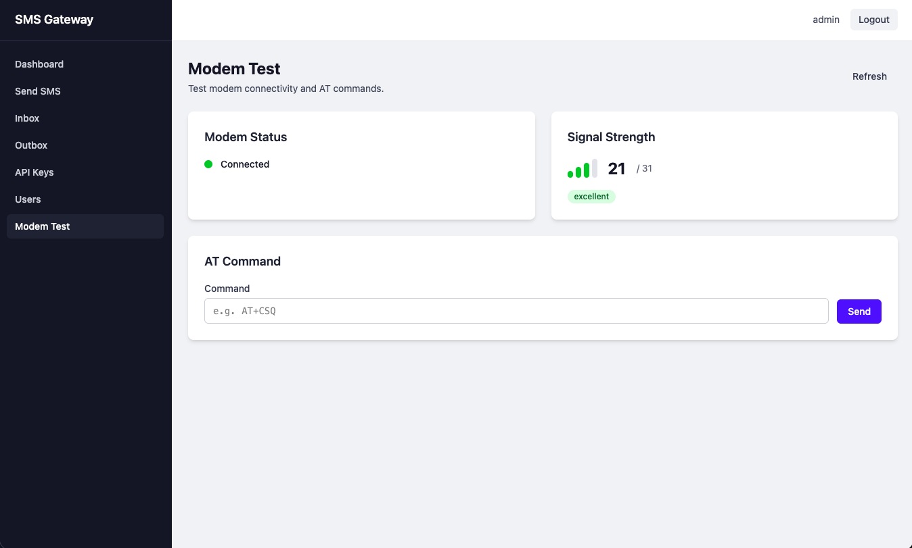
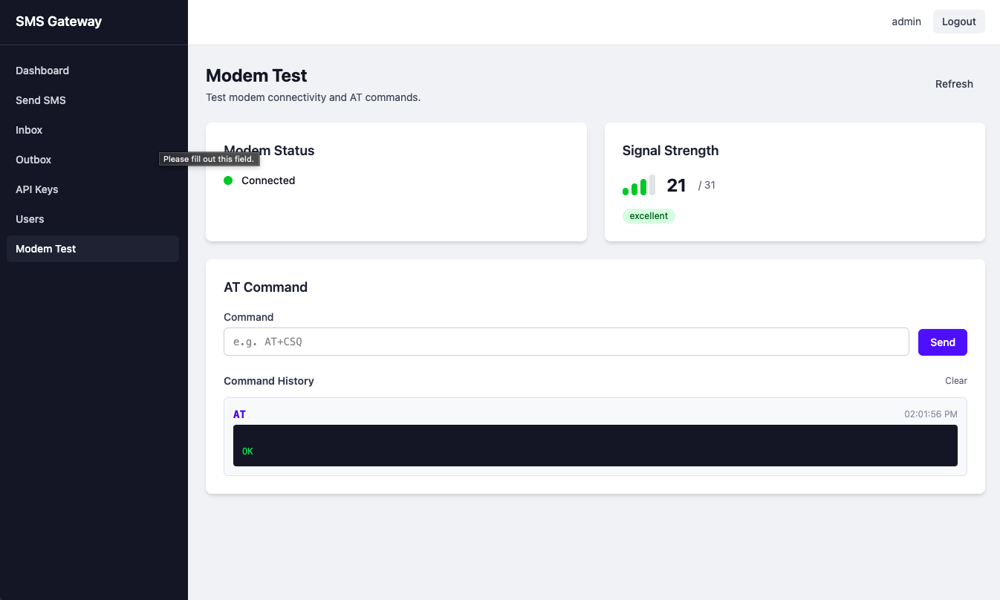
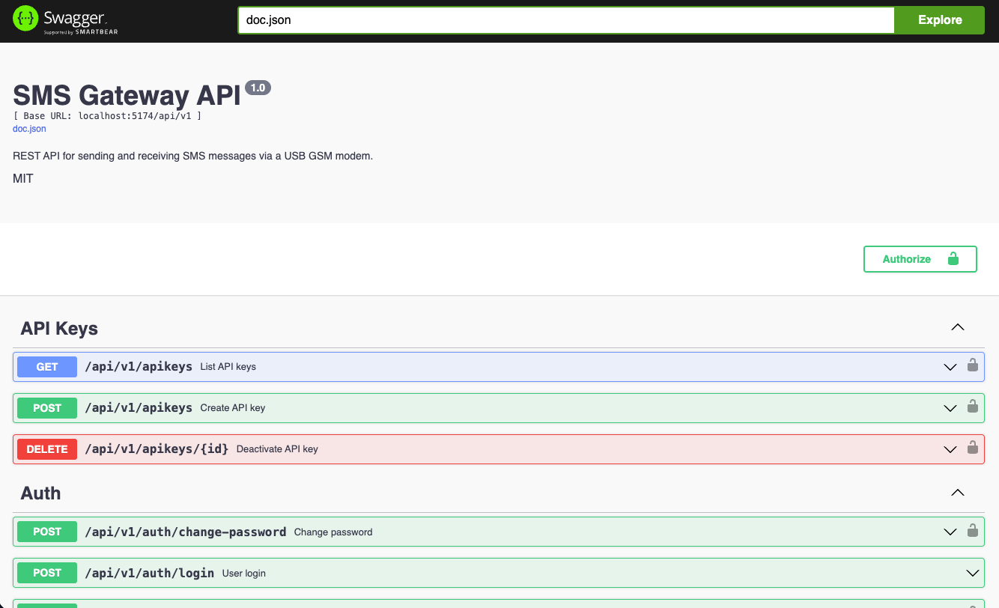

## Quick Start

### Prerequisites

- A USB GSM modem (e.g., Huawei E220, SIM800)
- Go 1.24+ and Node.js 22+ (for building from source)

### Automated Install

The install script will guide you through setting up SMS Gateway as either a systemd service. It fetches the latest release automatically.

```bash
curl -fsSL https://raw.githubusercontent.com/mattboston/sms-gateway/main/install.sh | sudo bash
```

Or download and run manually:

```bash
curl -fsSL -o install.sh https://raw.githubusercontent.com/mattboston/sms-gateway/main/install.sh
chmod +x install.sh
sudo ./install.sh
```

You will be prompted to choose an install method and provide configuration (device path, port, JWT secret).

### Manual Install: Systemd

Download the latest release from [GitHub Releases](https://github.com/mattboston/sms-gateway/releases) and set up the service manually:

```bash
# Create service user
sudo useradd -r -s /usr/sbin/nologin sms-gateway
sudo usermod -aG dialout sms-gateway

# Install binary
sudo mkdir -p /opt/sms-gateway
sudo cp sms-gateway-linux-amd64 /opt/sms-gateway/sms-gateway
sudo chmod 755 /opt/sms-gateway/sms-gateway

# Configure (edit to match your setup)
sudo cp deploy/systemd/sms-gateway.conf /opt/sms-gateway/
sudo chmod 600 /opt/sms-gateway/sms-gateway.conf
sudo chown -R sms-gateway:sms-gateway /opt/sms-gateway

# Install systemd unit
sudo cp deploy/systemd/sms-gateway.service /etc/systemd/system/
sudo systemctl daemon-reload
sudo systemctl enable --now sms-gateway
```

### Manual Install: Pre-built Binary

```bash
chmod +x sms-gateway-linux-amd64
./sms-gateway-linux-amd64 serve --device-path /dev/ttyUSB0 --jwt-secret your-secret
```

### From Source

```bash
# Install dependencies
just init

# Build
just build

# Run (development mode with mock modem)
just dev

# Run (production with real modem)
./bin/sms-gateway serve --device-path /dev/ttyUSB0 --jwt-secret your-secret
```

### Docker Compose

Build and run the production container:

```bash
docker compose pull
docker compose up -d
```

The included [`docker-compose.yml`](/Users/matt/Development/mattboston/sms-gateway.feat-docker-support/docker-compose.yml) pulls the published GHCR image by default, passes configuration through environment variables, persists app state in a named volume mounted at `/opt/sms-gateway`, and exposes the host `/dev` tree with a `ttyUSB` device cgroup rule so the container can open `/dev/ttyUSB*`.

Minimal example:

```bash
JWT_SECRET=replace-me \
DEVICE_PATH=/dev/ttyUSB0 \
IMAGE_VERSION=latest \
docker compose up -d
```

Important notes:

- Released container images are published to `ghcr.io/mattboston/sms-gateway` and tagged with the same version string as the release binaries.
- Set `IMAGE_VERSION` to a release tag such as `0.0.1`, or leave it at `latest`.
- `DEVICE_PATH` should point at the modem node on the host, for example `/dev/ttyUSB0`.
- The `/dev:/dev` bind is intentional so reconnects that change the modem from `/dev/ttyUSB0` to another `/dev/ttyUSB*` path do not require editing the Compose file.
- If your Docker host enforces extra device restrictions beyond the default cgroup rules, you may still need host-specific allowances.

## Default Login

On first start, a default admin account is created:

- **Username:** `admin`
- **Password:** `admin123`

You will be required to change the password on first login.

## Web UI

Open the WebUI at `http://localhost:5174` and sign in with an admin account.

- Use **Send SMS** to send a test message.
- Use **Inbox** to confirm inbound messages are being received.
- Use **Outbox** to confirm delivery records.
- Use **API Keys** to create keys for external integrations (for example, OpenClaw).

## OpenClaw Integration

Use the bundled OpenClaw skill and scripts in `openclaw/` to send and receive SMS from OpenClaw.

1. Copy the OpenClaw skill files into your OpenClaw workspace:

   ```bash
   mkdir -p ~/.openclaw/workspace/skills/sms-gateway
   cp -R openclaw/* ~/.openclaw/workspace/skills/sms-gateway/
   ```

2. Create your script environment file:

   ```bash
   cp ~/.openclaw/workspace/skills/sms-gateway/scripts/.env.example ~/.openclaw/workspace/skills/sms-gateway/scripts/.env
   ```

3. Log in to the SMS Gateway WebUI.
4. Go to API Keys and create a new API key.
5. Set `SMS_GATEWAY_API_KEY` in `~/.openclaw/workspace/skills/sms-gateway/scripts/.env` to that new key.
6. Update `~/.openclaw/workspace/skills/sms-gateway/scripts/allowlist.json` with allowed names and phone numbers.
7. Test outbound messaging:

   ```bash
   cd ~/.openclaw/workspace/skills/sms-gateway/scripts
   ./send_sms.sh "+15551234567" "Test message from OpenClaw"
   ```

8. Restart OpenClaw so it picks up the new skill and config.
9. In OpenClaw, ask it to send an SMS message to a user in your allowlist.
10. Ask OpenClaw to check for incoming SMS messages every minute.

Example `allowlist.json` entry format:

```json
{
  "users": [
    {
      "name": "Alice Example",
      "phone": "+15551234567"
    }
  ]
}
```

## Configuration

Configuration is done via a config file, CLI flags, or environment variables.

| Flag | Env Var | Default | Description |
|------|---------|---------|-------------|
| `--port` | `PORT` | `5174` | HTTP server port |
| `--db-driver` | `DB_DRIVER` | `sqlite` | Database driver (`sqlite` or `postgres`) |
| `--db-dsn` | `DB_DSN` | `/opt/sms-gateway/sms-gateway.db` | Database connection string |
| `--config-file` | `CONFIG_FILE` | `/opt/sms-gateway/sms-gateway.conf` | Path to config file |
| `--device-path` | `DEVICE_PATH` | | Serial device path (e.g., `/dev/ttyUSB0`) |
| `--baud-rate` | `BAUD_RATE` | `9600` | Serial baud rate |
| `--jwt-secret` | `JWT_SECRET` | `change-me-in-production` | JWT signing secret |
| `--dev-mode` | `DEV_MODE` | `false` | Enable dev mode (mock modem, CORS) |

## CLI Commands

```bash
# Start the server
sms-gateway serve [flags]

# Database migrations
sms-gateway migrate up
sms-gateway migrate down
sms-gateway migrate status

# User management
sms-gateway user create --username alice --password secret --admin

# API key management
sms-gateway apikey create --label "my-app" --user-id <uuid>
sms-gateway apikey list
sms-gateway apikey revoke --id <uuid>
```

## API

Interactive API documentation is available at `/swagger/index.html` when the server is running.

### Authentication

**JWT (WebUI):** POST to `/api/v1/auth/login` with username/password to get a token.

**API Key:** Include `X-API-Key: <key>` header in requests.

### Key Endpoints

| Method | Path | Auth | Description |
|--------|------|------|-------------|
| GET | `/api/v1/health` | None | Health check |
| POST | `/api/v1/auth/login` | None | Login |
| POST | `/api/v1/sms/send` | JWT or API Key | Send SMS |
| GET | `/api/v1/sms/inbox` | JWT or API Key | List received messages |
| GET | `/api/v1/sms/outbox` | JWT or API Key | List sent messages |
| GET | `/api/v1/sms/{id}` | JWT or API Key | Get message by ID |
| PUT | `/api/v1/sms/{id}/read` | JWT or API Key | Mark message as read |
| DELETE | `/api/v1/sms/{id}` | JWT or API Key | Delete a message |
| GET | `/api/v1/modem/status` | JWT or API Key | Modem status |
| GET | `/api/v1/modem/signal` | JWT or API Key | Signal strength |
| POST | `/api/v1/modem/at` | JWT + Admin | Send raw AT command |
| GET | `/api/v1/apikeys` | JWT | List API keys |
| POST | `/api/v1/apikeys` | JWT | Create API key |
| GET | `/api/v1/users` | JWT + Admin | List users |
| POST | `/api/v1/users` | JWT + Admin | Create user |

## Development

Before contributing, review `CONTRIBUTING.md` for branch naming, conventional commit requirements, hook setup (`just init`), and pull request expectations.

### Prerequisites

- Go 1.24+
- Node.js 22+
- [Just](https://github.com/casey/just) command runner

### Commands

```bash
just dev            # Run backend + frontend dev servers
just build          # Build production binary
just test           # Run Go tests
just lint           # Run all linters
just format         # Run all formatters
just swagger        # Regenerate Swagger docs
just migrate-new X  # Create new migration named X
```

### Project Structure

```
src/
  cmd/sms-gateway/    # CLI entrypoint
  internal/
    api/              # HTTP handlers, router, middleware
    auth/             # JWT, bcrypt, API key generation
    config/           # Configuration loading
    database/         # Database connection, repository, migrations
    models/           # Domain types and request/response models
    modem/            # Serial/AT modem interface and mock
  web/                # React frontend (Vite + TypeScript + Tailwind)
  migrations/         # Goose SQL migrations
  docs/               # Generated Swagger docs
```

## License

GPL-3.0
